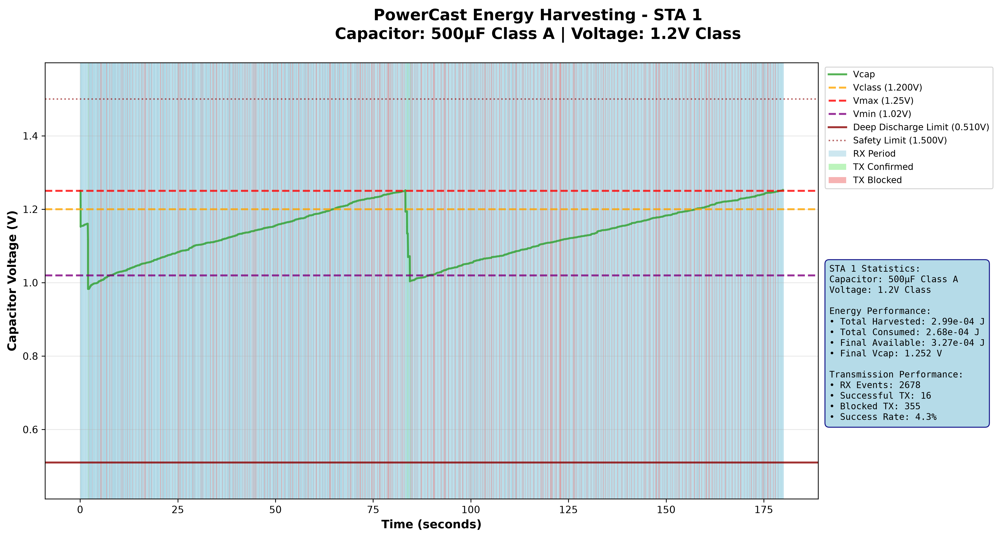
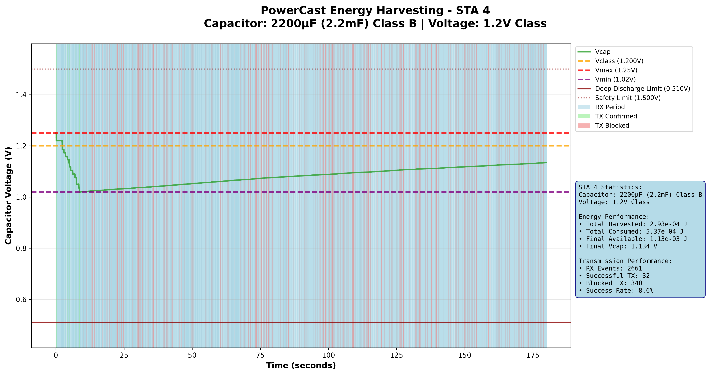
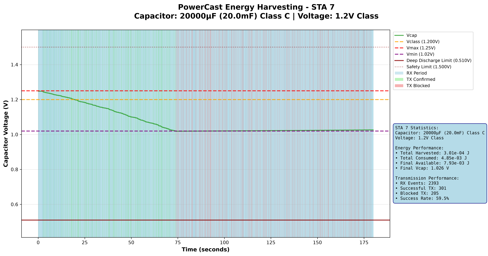

# PowerCast Hardware Module - P21XXCSR-EVB Energy Harvester

<!--
  Copyright (c) 2025 Texas State University

  This program is free software; you can redistribute it and/or modify
  it under the terms of the GNU General Public License version 2 as
  published by the Free Software Foundation;

  This program is distributed in the hope that it will be useful,
  but WITHOUT ANY WARRANTY; without even the implied warranty of
  MERCHANTABILITY or FITNESS FOR A PARTICULAR PURPOSE.  See the
  GNU General Public License for more details.

  You should have received a copy of the GNU General Public License
  along with this program; if not, write to the Free Software
  Foundation, Inc., 59 Temple Place, Suite 330, Boston, MA  02111-1307  USA

  Author: Ahmed Maksud <ahmed.maksud@email.ucr.edu>
  PI: Marcelo Menezes De Carvalho <mmcarvalho@txstate.edu>
  Texas State University
-->

## Overview

NS-3 implementation of the **PowerCast P21XXCSR-EVB Band 6** RF energy harvester for realistic 2.4GHz WiFi energy harvesting simulations. This module models energy-harvesting hardware with safety mechanisms and flexible deployment configurations.

**Author:** Ahmed Maksud <ahmed.maksud@email.ucr.edu>  
**PI:** Marcelo Menezes De Carvalho <mmcarvalho@txstate.edu>  
**Affiliation:** Texas State University  
**License:** GPL v2

## Quick Start

The deployment script handles everything: copying files to NS-3, building, running the simulation, and generating plots.

```bash
# Clone the repository (from NS3-project directory)
cd /path/to/your/NS3-project
git clone https://github.com/ahmedmaksud/Powercast-Energy-Harvester-NS3.git

# Deploy, build, run, and plot
cd Powercast-Energy-Harvester-NS3
./deploy-to-ns3.sh
```

This script will:

1. Deploy source files to `ns-3.44/contrib/ai/examples/powercast_hardware/`
2. Update CMakeLists.txt if needed
3. Configure NS-3 (required to register new build targets)
4. Build the `ph-harvester-demo` executable
5. Run the simulation
6. Activate the Python virtual environment
7. Generate visualization plots

### Prerequisites

- **NS-3.44** with NS3-AI module installed (see [NS3-NS3AI--installation-and-tests](https://github.com/ahmedmaksud/NS3-NS3AI--installation-and-tests.git))
- **Python virtual environment** (e.g., `EHRL`, as specified in `venv_name.txt`) with pandas and matplotlib

### Manual Execution (Optional)

If you prefer to run steps individually:

```bash
# Build only
cd ~/NS3-project/ns-allinone-3.44/ns-3.44
./ns3 configure --enable-examples --enable-tests
./ns3 build ph-harvester-demo

# Run simulation with custom parameters
./ns3 run "ph-harvester-demo --time=120 --numStas=8"

# Generate plots manually
# Replace <venv_name> with the name in venv_name.txt (e.g., EHRL)
source ~/NS3-project/<venv_name>/bin/activate
cd contrib/ai/examples/powercast_hardware
python3 ph-harvester-plot.py --csv-file ph-pcap/ph-harvester-demo-log.csv
```

### Command-Line Options

| Parameter      | Default        | Description                          |
| -------------- | -------------- | ------------------------------------ |
| `--time`       | 180            | Simulation time in seconds           |
| `--numStas`    | 8              | Number of STA nodes                  |
| `--apPower`    | 55             | AP transmission power (dBm)          |
| `--staPower`   | 15             | STA transmission power (dBm)         |
| `--ulRate`     | 1.0            | Uplink data rate (Mbps)              |
| `--dlRate`     | 54.0           | Downlink data rate (Mbps)            |
| `--ulPayload`  | 1              | Uplink payload size (bytes)          |
| `--dlPayload`  | 2048           | Downlink payload size (bytes)        |
| `--ulMcs`      | DsssRate1Mbps  | Uplink MCS mode                      |
| `--dlMcs`      | HtMcs7         | Downlink MCS mode                    |
| `--configFile` | (default path) | Path to harvester configuration file |

## Example Results

The [`ph-pcap/`](ph-pcap/) directory contains reference artifacts from a default run (`--time=180 --numStas=8`) so you can inspect expected output without building NS-3:

- **`*_analysis.png`** — per-STA energy plots (one per station)
- **`*.pcap`** — packet captures for the AP and each STA (open in Wireshark)
- **`ph-harvester-demo-log.csv`** — the full event log the plots are generated from

### Effect of Capacitor Size

STA 1, 4, and 7 all use the **1.2 V voltage class** but step through the three capacitor classes, isolating the effect of storage size. All three harvest ~3×10⁻⁴ J from the same RF environment, yet the larger reservoir sustains far more transmissions:

| STA | Capacitor | Total Harvested | Total Consumed | TX Success Rate |
| --- | --------------- | --------------- | -------------- | --------------- |
| 1   | 500 µF (Class A)   | 2.99×10⁻⁴ J | 2.68×10⁻⁴ J | **4.3%** (16 / 371) |
| 4   | 2200 µF (Class B)  | 2.93×10⁻⁴ J | 5.37×10⁻⁴ J | **8.6%** (32 / 372) |
| 7   | 20000 µF (Class C) | 3.01×10⁻⁴ J | 4.85×10⁻³ J | **59.5%** (301 / 506) |



*Class A (500 µF): the small capacitor charges and drains rapidly, producing a sawtooth Vcap trace. It clamps at Vmax twice, but most transmissions are blocked for lack of stored energy.*



*Class B (2200 µF): early bursts drain Vcap down to Vmin, after which it recovers slowly and climbs steadily — a modestly higher success rate than Class A.*



*Class C (20000 µF): the large reservoir holds enough charge to keep Vcap near Vmin while sustaining a steady stream of transmissions — a 59.5% success rate on the same input power.*

The remaining stations (STA 2, 3, 5, 6, 8) exercise the other capacitor/voltage-class combinations; their plots are in [`ph-pcap/`](ph-pcap/).


## Key Features

### Hardware Modeling

- ✅ **P21XXCSR-EVB Band 6 Specifications**: 2.4 GHz (2400-2500 MHz) operation
- ✅ **Realistic Efficiency Curve**: Based on actual datasheet characterization
- ✅ **Input Power Range**: -40 to +15 dBm with automatic clamping
- ✅ **Fixed Efficiencies**: 90% boost converter, 90% PA from datasheet
- ✅ **Advanced Energy Model**: Three-tier system (nominal/sunk/available energy)

### Safety Mechanisms

- ✅ **Input Power Clamping**: Prevents hardware damage at +15 dBm maximum
- ✅ **Deep Discharge Protection**: DEEP_RATIO (50% of Vmin) prevents over-discharge
- ✅ **Overshoot Protection**: SHOOT_RATIO (150% of Vmax) limits maximum voltage
- ✅ **Pre-transmission Validation**: `CanSustainTransmission()` prevents unrealistic energy states
- ✅ **Critical Error Detection**: NS_FATAL_ERROR for impossible energy consumption

### Configuration System

- ✅ **Three Capacitor Classes**: Configurable via file (A, B, C)
- ✅ **Three Voltage Classes**: 1.2V, 0.9V, 0.7V operation modes
- ✅ **File-based Configuration**: Large-scale deployment support
- ✅ **Per-node Customization**: Individual harvester configurations
- ✅ **Template-based Deployment**: Predefined configuration patterns

## Hardware Specifications

### P21XXCSR-EVB Band 6 Parameters

| Parameter               | Value          | Description                      |
| ----------------------- | -------------- | -------------------------------- |
| **Operating Frequency** | 2450 MHz       | Center frequency for 2.4GHz WiFi |
| **Input Power Range**   | -40 to +15 dBm | Realistic harvesting range       |
| **Boost Efficiency**    | 90%            | Fixed from datasheet             |
| **PA Efficiency**       | 90%            | Fixed for TX modeling            |
| **Maximum Input**       | +15 dBm        | Hardware protection limit        |

### Capacitor Classes (Configurable)

| Class       | Default Value    | Description           | Typical Use                   |
| ----------- | ---------------- | --------------------- | ----------------------------- |
| **CLASS_A** | 500 μF (0.5 mF)  | Electrolytic - Small  | Short bursts, fast response   |
| **CLASS_B** | 2200 μF (2.2 mF) | Electrolytic - Medium | Medium capacity, balanced     |
| **CLASS_C** | 20000 μF (20 mF) | Electrolytic - Large  | High capacity, long operation |

**Note:** Capacitor values are loaded from `ph-harvester-config.txt` - no hardcoded defaults.

### Voltage Classes

| Class       | Threshold | Vmax   | Vmin  | Description              |
| ----------- | --------- | ------ | ----- | ------------------------ |
| **CLASS_1** | 1.2V      | 1.25V  | 1.02V | High voltage operation   |
| **CLASS_2** | 0.9V      | 0.945V | 0.9V  | Medium voltage operation |
| **CLASS_3** | 0.7V      | 0.738V | 0.64V | Low voltage operation    |

## Efficiency Model

### Realistic 2.4GHz Efficiency Curve

The module implements a realistic efficiency curve based on P21XXCSR-EVB characterization:

| Power Range    | Efficiency | Behavior                         |
| -------------- | ---------- | -------------------------------- |
| < -40 dBm      | 0%         | Below sensitivity                |
| -40 to -30 dBm | 0-10%      | Sensitivity threshold            |
| -30 to -10 dBm | 10-40%     | Active harvesting (typical WiFi) |
| -10 to 0 dBm   | 40-70%     | High power region                |
| 0 to +10 dBm   | 70-85%     | Peak efficiency approach         |
| +10 to +15 dBm | 85%        | Maximum saturation               |
| > +15 dBm      | Clamped    | Hardware protection              |

## Core Components

### 1. PowercastEnergyHarvester Class

**File:** `ph-harvester-hardware.h/cc`

Main energy harvester implementation with P21XXCSR-EVB specifications.

**Key Methods:**

```cpp
// Energy management
void SetHarvestedEnergy(double rxPowerDbm, Time duration);
void SetConsumedEnergy(double txPowerDbm, Time duration);

// Configuration
void Configure(CapacitorClass capClass, VoltageClass voltClass);

// Status checking
double GetAvailableEnergy() const;
double GetVcap() const;
bool IsOutputEnabled() const;
bool CanSustainTransmission(double txPowerDbm, Time duration) const;

// Statistics
double GetTotalHarvestedEnergy() const;
double GetTotalConsumedEnergy() const;
```

### 2. PowercastEnergyHarvesterHelper Class

**File:** `ph-deployment-helper.h/cc`

Advanced helper for large-scale deployment with file-based configuration.

**Key Features:**

- File-based configuration loading
- Template-based deployment patterns
- Per-node customization
- Automatic energy source management
- Statistics and validation

**Key Methods:**

```cpp
// Configuration
bool LoadConfigurationFromFile(const std::string& filename);
void SetDefaultTemplate(DeploymentTemplate templateType);
void ConfigureNode(uint32_t nodeId, CapacitorClass cap, VoltageClass volt);

// Installation
EnergyHarvesterContainer Install(EnergySourceContainer sources);

// Utilities
std::string GetConfigurationStatistics() const;
bool ExportConfigurationToFile(const std::string& filename) const;
```

### 3. Demo Application

**File:** `ph-harvester-demo.cc`

Comprehensive demonstration of energy harvesting in WiFi networks.

**Features:**

- Multiple STAs with different configurations
- PHY-layer RX signal monitoring
- Real-time energy statistics
- CSV data export for analysis
- Safety mechanism validation

## Configuration File Format

### ph-harvester-config.txt

```
# PowerCast Energy Harvester Configuration
# Format: NodeID CapacitorClass VoltageClass
#
# Capacitor Classes: A, B, C (values defined below)
# Voltage Classes: 1 (1.2V), 2 (0.9V), 3 (0.7V)

# Capacitor value definitions (required)
# CAP_A 500       # Class A: 500μF (0.5mF) electrolytic
# CAP_B 2200      # Class B: 2200μF (2.2mF) electrolytic
# CAP_C 20000     # Class C: 20000μF (20mF) electrolytic

# Node configurations
0 A 1    # Node 0: 500μF capacitor, 1.2V threshold
1 B 2    # Node 1: 2200μF capacitor, 0.9V threshold
2 C 3    # Node 2: 20000μF capacitor, 0.7V threshold
3 A 2    # Node 3: 500μF capacitor, 0.9V threshold
```

## Usage Example

### Basic WiFi Network with Energy Harvesting

```cpp
#include "ph-harvester-hardware.h"
#include "ph-deployment-helper.h"

// Create nodes
NodeContainer apNode, staNodes;
apNode.Create(1);
staNodes.Create(4);
NodeContainer allNodes = NodeContainer(apNode, staNodes);

// Setup WiFi (standard NS-3 configuration)
WifiHelper wifi;
wifi.SetStandard(WIFI_STANDARD_80211n);
// ... configure WiFi ...

// Setup energy system
BasicEnergySourceHelper energySourceHelper;
energySourceHelper.Set("BasicEnergySourceInitialEnergyJ", DoubleValue(100.0));
EnergySourceContainer energySources = energySourceHelper.Install(allNodes);

// Read harvester config file (loads capacitor values and per-node assignments)
std::map<uint32_t, HarvesterConfig> configs = ReadHarvesterConfig("ph-harvester-config.txt");

// Configure each STA harvester from file
PowercastEnergyHarvesterHelper harvesterHelper;
for (uint32_t i = 1; i <= 4; ++i) {
    const auto& cfg = configs[i - 1];  // File uses 0-based indexing
    harvesterHelper.ConfigureNode(i, cfg.capacitorClass, cfg.voltageClass);
}

// Install harvesters on STAs (skip AP at index 0)
EnergySourceContainer staEnergySources;
for (uint32_t i = 1; i <= 4; ++i) {
    staEnergySources.Add(energySources.Get(i));
}
EnergyHarvesterContainer harvesters = harvesterHelper.Install(staEnergySources);

// Connect PHY traces for energy harvesting
Config::Connect("/NodeList/*/DeviceList/*/$ns3::WifiNetDevice/Phy/$ns3::WifiPhy/PhyRxBegin",
                MakeCallback(&OnPhyRxBegin));

// Run simulation
Simulator::Run();
```

### Alternative: File-based Configuration

You can also use `LoadConfigurationFromFile()` to load and apply all node configurations in one step:

```cpp
PowercastEnergyHarvesterHelper harvesterHelper;
harvesterHelper.LoadConfigurationFromFile("ph-harvester-config.txt");

// Install harvesters on STA energy sources
EnergyHarvesterContainer harvesters = harvesterHelper.Install(staEnergySources);
```

Both approaches are valid — choose whichever fits your deployment workflow.

## Data Output and Analysis

### CSV Output Format

The demo generates `ph-pcap/ph-harvester-demo-log.csv` with columns:

| Column             | Description                    |
| ------------------ | ------------------------------ |
| Timestamp_s        | Simulation time                |
| STA_ID             | Station identifier             |
| Event_Type         | RX, TX, TX_BLOCKED             |
| RX_Power_dBm       | Received power                 |
| TX_Power_dBm       | Transmitted power              |
| Packet_Size_bytes  | Packet size                    |
| Duration_us        | Event duration in microseconds |
| Harvested_Energy_J | Energy harvested               |
| Consumed_Energy_J  | Energy consumed                |
| Available_Energy_J | Current available energy       |
| Vcap_V             | Capacitor voltage              |
| Cap_Class          | Capacitor class (A, B, C)      |
| Volt_Class         | Voltage class (1, 2, 3)        |
| Block_Status       | Transmission blocked status    |
| Success_Status     | Transmission success status    |
| Output_Status      | Output enabled (0/1)           |
| Additional_Info    | Extra event information        |

### Visualization

Use `ph-harvester-plot.py` for data visualization:

```bash
# Plot a specific STA
python3 ph-harvester-plot.py --csv-file ph-pcap/ph-harvester-demo-log.csv --sta-id 1

# Plot all STAs (prompted interactively)
python3 ph-harvester-plot.py --csv-file ph-pcap/ph-harvester-demo-log.csv
```

## Advanced Features

### Energy State Validation

```cpp
// Check before transmission
Ptr<PowercastEnergyHarvester> harvester = ...;
Time txDuration = MicroSeconds(200);
double txPowerDbm = 15.0;

if (harvester->CanSustainTransmission(txPowerDbm, txDuration)) {
    // Safe to transmit
    harvester->SetConsumedEnergy(txPowerDbm, txDuration);
    // Send packet
} else {
    // Block transmission - insufficient energy
    NS_LOG_WARN("Transmission blocked due to insufficient energy");
}
```

### Real-time Monitoring

```cpp
// Get current status
double availableEnergy = harvester->GetAvailableEnergy();
double voltage = harvester->GetVcap();
bool canTransmit = harvester->IsOutputEnabled();

std::cout << "Available Energy: " << availableEnergy << " J\n";
std::cout << "Capacitor Voltage: " << voltage << " V\n";
std::cout << "Can Transmit: " << (canTransmit ? "Yes" : "No") << "\n";
```

## File Structure

```
Powercast-Energy-Harvester-NS3/
├── ph-harvester-hardware.h         # Main harvester header
├── ph-harvester-hardware.cc        # Harvester implementation
├── ph-deployment-helper.h          # Helper class header
├── ph-deployment-helper.cc         # Helper implementation
├── ph-harvester-demo.cc            # Complete demo application
├── ph-harvester-config.txt         # Configuration file
├── ph-harvester-plot.py            # Visualization script
├── deploy-to-ns3.sh                # Deployment and run script
├── CMakeLists.txt                  # Build configuration
├── powercast-hardware.drawio       # Hardware diagram (draw.io)
├── .gitignore                      # Git ignore rules
└── README.md                       # This file
```
